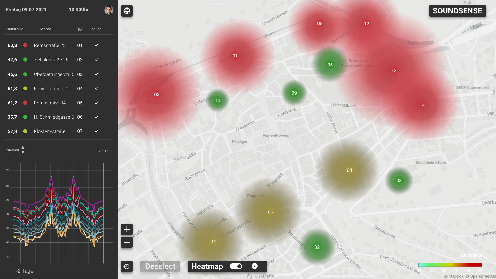

# soundsense-frontend

This is a prototypical frontend in a minimal viable state of the SoundSense Sensor network.
In the current state it provides you with the newest sensor values and puts them in a list. Also you can see the Markers of the sensors and where they're placed by their designated location values. You can click them and highlight the list entry of the corresponding Sensor Marker.

In future iterations of this frontend there will be graphs implemented and a replaying feature so you can look at past datasets with a time lapse mode. Also a Heatmap will be added to show the user the noise Hotspots.

UI Design prototype: 


<br>
Deployed Frontend [https://soundsensefe.ds.ava.hfg.design/#/reg](https://soundsensefe.ds.ava.hfg.design/#/reg)


<br>
<br>

## Setting up the project
<br>

download the project folder onto your machine and execute 
```
cd <folder path>
```
after your in the folder you execute
```
npm install
```
<br>
<br>

## Running it
after everything is set up you just run 
```
npm run serve
```
<br>
<br>
<br>

# Bonus:
 when you're also running the SoundSense backend locally you can replace the axios base url at line 12 in main.js with your local backend ip to gain access to your local instance of the backend
<br>
and now you can look at it locally
<br>
<br>
<br>


## HfG Online Exhibition Page
<!--See [Configuration Reference](https://cli.vuejs.org/config/).-->
link will follow prior to the exhibition weekend
